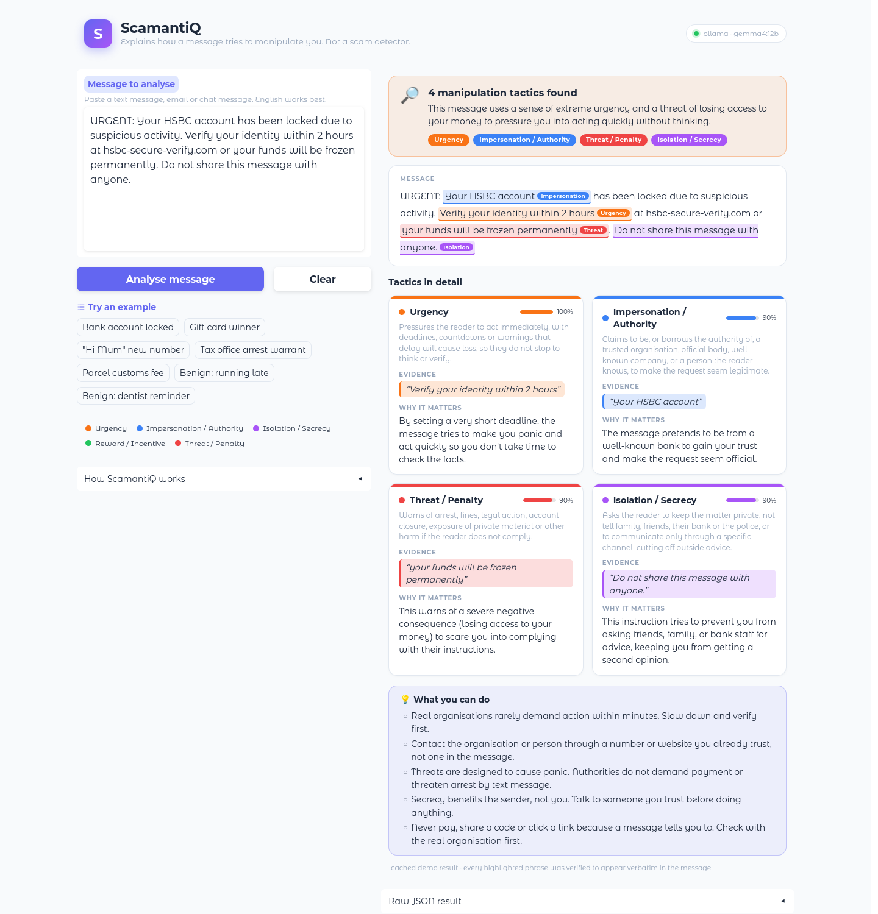
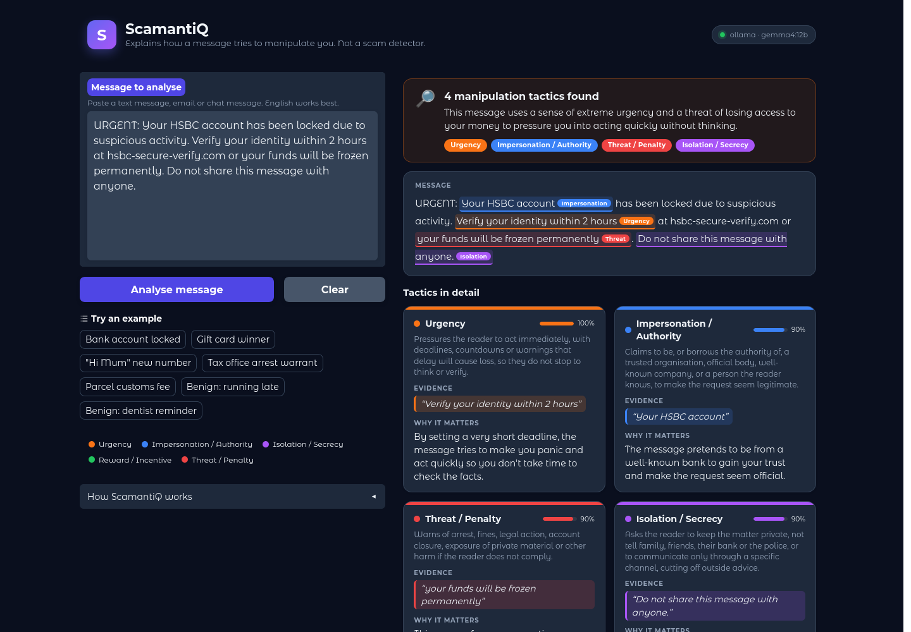

# Scamantics

**Explainable analysis of how a message tries to manipulate you.**
Paste a suspicious text and Scamantics names the manipulation tactics it uses, quotes the exact phrases as evidence, and explains each one in plain language.

> Scamantics is an educational aid, **not a scam detector**. It never says "this is a scam". A message can use pressure tactics and still be legitimate, and a scam can be written without any of them. The user makes the call; Scamantics shows them what to look at.



<details>
<summary>Dark theme</summary>


</details>

## Contents

1. [What it does](#what-it-does)
2. [Quick start](#quick-start)
3. [How it works](#how-it-works)
4. [The five tactics](#the-five-tactics)
5. [Choosing an LLM backend](#choosing-an-llm-backend)
6. [Evaluation](#evaluation)
7. [Limitations](#limitations)
8. [Project layout](#project-layout)
9. [Development](#development)

## What it does

| | |
|---|---|
| **Detects** | whether a message contains persuasive or coercive patterns |
| **Identifies** | one or more tactics from a fixed taxonomy of five |
| **Grounds** | every tactic in a verbatim quote from the message, checked by code, not by the model |
| **Explains** | each tactic for a non-expert, with practical advice on what to do next |

What it does **not** do: decide whether a message is fraudulent, check who sent it, follow links, or replace advice from your bank or the police.

## Quick start

```bash
conda activate scamantics          # or: pip install -r requirements.txt
python app.py                      # open http://127.0.0.1:7860
```

The default backend is a **local Ollama** server running `gemma4:12b`, which costs nothing. Two other local options, SGLang and vLLM, and several cloud APIs are one environment variable away (or put it in `.env`, see `.env.example`):

```bash
SCAMANTICS_PROVIDER=sglang python app.py                 # local SGLang server on :30000
SCAMANTICS_PROVIDER=groq GROQ_API_KEY=... python app.py  # cloud API
```

Add `SCAMANTICS_SHARE=1` to print a temporary public `gradio.live` link as well. If the model backend is unreachable, the app falls back to precomputed answers for the built-in examples, so the demo still runs offline.

## How it works

```
message ─► one LLM call: detect + identify + quote + explain  (JSON schema)
        ─► validator: every quote must appear verbatim in the message
               └─ rejected quotes ─► one retry asking the model to correct them
        ─► UI: highlighted evidence · tactic cards · advice · disclaimer
```

1. **Detect and identify.** A pretrained LLM judges whether manipulation is present and labels the tactics from the fixed list. Detection, classification, evidence and explanation are produced in a single request to keep latency and cost low.
2. **Ground.** For each tactic the model must quote the exact words that support it.
3. **Verify.** Python checks that every quote is a verbatim substring of the message. Quotes that are not are rejected and the model is asked once to fix them. A tactic with no surviving evidence is dropped, and a message with no verified evidence is never flagged. Case, whitespace and curly-quote differences are tolerated when *locating* a quote, but the text shown to the user is always the exact source span.
4. **Explain.** Each verified tactic is displayed with its evidence, a plain-language explanation and the model's self-reported confidence.

No model is trained and no GPU is required; the LLM is a configuration choice.

## The five tactics

| Label | Tactic | What it looks like | Why it is in the taxonomy |
|---|---|---|---|
| `urgency` | Urgency | deadlines, countdowns, "act now" | Time pressure stops the reader from verifying. The "pressure you to act immediately" warning sign; scarcity in Cialdini; the *time* principle in Stajano and Wilson. |
| `impersonation` | Impersonation / authority | "This is your bank", "Hi Mum, new number" | Borrowing a trusted identity is the entry point of most phishing and family-emergency scams. The "pretend to be an organisation you know" sign; the *authority* principle. |
| `isolation` | Isolation / secrecy | "don't tell the bank", "keep this between us" | Cutting the target off from second opinions is what makes the other tactics hard to break; characteristic of romance, courier and safe-account scams. |
| `reward` | Reward / incentive | prizes, refunds, jobs, guaranteed returns | Exploits *need and greed*; the "there's a prize" half of the "problem or prize" sign. |
| `threat` | Threat / penalty | arrest, fines, account closure, exposure | Exploits fear; the "there's a problem" half of "problem or prize" and the coercive counterpart of reward. |

**Why five, and why these?** The taxonomy is small and fixed so that outputs are comparable across messages and models, and so that each label has an operational definition a non-expert can check against the quoted evidence. The five labels cover the warning signs published by consumer-protection agencies such as the US FTC (impersonation, problem or prize, pressure to act, unusual payment). Reward and threat are kept apart because they need different explanations; isolation is added because it is the tactic that most directly removes the user's ability to seek help. The "unusual payment method" sign is about the requested action rather than the wording, so it is handled by the safety disclaimer instead of a label.

Definitions, examples, colours and advice text live in `scamantics/taxonomy.py` and are injected into the system prompt.

References: Cialdini, *Influence: The Psychology of Persuasion* (1984) · Stajano and Wilson, "Understanding scam victims: seven principles for systems security", *Communications of the ACM* 54(3), 2011 · US Federal Trade Commission, "How to avoid a scam".

## Choosing an LLM backend

All backends implement the same two-method interface (`complete_json`, `healthcheck`) in `scamantics/providers/`. Select one with `SCAMANTICS_PROVIDER`:

| Value | Backend | Key | Notes |
|---|---|---|---|
| `ollama` (default) | local Ollama `/api/chat` | none | GGUF models, JSON-schema-constrained output, one command to run |
| `sglang` | local SGLang server, OpenAI-compatible | none | HF weights, JSON-schema-constrained output, high throughput |
| `vllm` | local vLLM server, OpenAI-compatible | none | HF weights, JSON-schema-constrained output, high throughput |
| `groq` | Groq (OpenAI-compatible) | `GROQ_API_KEY` | free tier, very fast |
| `gemini` | Google Gemini | `GEMINI_API_KEY` | free tier, schema-constrained |
| `openrouter` | OpenRouter (OpenAI-compatible) | `OPENROUTER_API_KEY` | has `:free` models |
| `deepseek` | DeepSeek (OpenAI-compatible) | `DEEPSEEK_API_KEY` | low cost |
| `openai` | OpenAI chat completions | `OPENAI_API_KEY` | default `gpt-4o-mini` |
| `anthropic` | Anthropic Messages API | `ANTHROPIC_API_KEY` | default `claude-haiku-4-5` |
| `mock` | cached demo answers only | none | offline tests and demos |

Override the preset's model or endpoint with `SCAMANTICS_MODEL` and `SCAMANTICS_BASE_URL`; any OpenAI-compatible server (vLLM, LM Studio, Together…) works with `SCAMANTICS_PROVIDER=openai`. Other knobs: `SCAMANTICS_MAX_RETRIES` (default 1), `SCAMANTICS_TEMPERATURE` (default 0), `SCAMANTICS_USE_CACHE` (default on).

**Ollama vs SGLang/vLLM.** Ollama runs quantised GGUF models and is the easiest to set up. SGLang and vLLM serve original HuggingFace weights with continuous batching, so they are the better choice for GPU machines and for running the evaluation quickly. All three support schema-constrained JSON, which is what keeps labels and fields well-formed. For local OpenAI-compatible servers the provider asks `GET /v1/models` for the served model when `SCAMANTICS_MODEL` is empty, and requests structured output in the strongest form the server accepts (`json_schema`, then `json_object`, then none).

Running SGLang in its own environment:

```bash
conda create -n sglang python=3.12 && conda activate sglang
pip install "sglang[all]"
python -m sglang.launch_server --model-path Qwen/Qwen2.5-7B-Instruct --port 30000
# then, in the scamantics env:
SCAMANTICS_PROVIDER=sglang python app.py
SCAMANTICS_PROVIDER=sglang python evaluate.py --no-cache --out results/eval_sglang_qwen2.5-7b.json
```

vLLM is the same with `python -m vllm.entrypoints.openai.api_server --model <model> --port 8000` and `SCAMANTICS_PROVIDER=vllm`.

**Offline cache.** `data/demo_cache.json` holds precomputed results for every message in the examples and the test set. It is served when the backend is down, and used by the `mock` provider. Rebuild it after changing the prompt or the model:

```bash
python scripts/build_demo_cache.py --all
```

## Evaluation

### Test set

`data/test_set.jsonl` contains 90 hand-written messages, each annotated with gold tactic labels and gold evidence spans.

| Category | n | Purpose |
|---|---|---|
| `familiar` | 25 | Classic scam templates: bank lock-out, prize, tax warrant, parcel fee… |
| `paraphrased` | 20 | Scams with unseen wording and different scenarios, to measure generalisation |
| `subtle_scam` | 15 | Low-cue scams: wrong-number openers, slow-burn investment and romance grooming, politely worded advance-fee offers. Two (`ss01`, `ss14`) contain no taxonomy tactic in the text and are labelled empty on purpose. |
| `benign` | 15 | Ordinary personal, commercial and institutional messages |
| `hard_benign` | 15 | Legitimate messages that *look* like scams: real fraud alerts, OTP warnings, payment reminders with deadlines, a genuine "lost my phone" text |

### Metrics

Reported overall and per category by `evaluate.py`:

| Metric | Measures |
|---|---|
| Detection accuracy / F1, false-positive rate | whether the message is flagged at all |
| Macro F1, micro F1, per-label F1 | multi-label tactic classification over the five labels |
| Grounding rate | share of the model's *raw* quotes that occur exactly in the source, counted before the validator repairs or rejects anything |
| Span F1 | token-level overlap between predicted and gold evidence spans, per label |
| Mean attempts | how often the retry was needed |

```bash
python evaluate.py                                        # current provider
python evaluate.py --provider groq --out results/groq.json
python evaluate.py --category hard_benign                 # one subset only
```

### Baseline results: `gemma4:12b` via Ollama

| Category | n | Detection acc. | Macro F1 | Micro F1 | Grounding | Span F1 |
|---|---|---|---|---|---|---|
| all | 90 | 0.978 | 0.943 | 0.939 | 1.000 | 0.786 |
| familiar | 25 | 1.000 | 0.970 | 0.969 | 1.000 | 0.793 |
| paraphrased | 20 | 1.000 | 0.964 | 0.951 | 1.000 | 0.736 |
| subtle_scam | 15 | 0.867 | 0.467 | 0.811 | 1.000 | 0.882 |
| benign | 15 | 1.000 | – | – | 1.000 | – |
| hard_benign | 15 | 1.000 | – | – | 1.000 | – |

Per-label F1: urgency 0.958 · impersonation 0.904 · isolation 0.963 · reward 0.955 · threat 0.938. Mean attempts 1.01; about 4 s per message on one GPU.

**Reading the numbers.** All 30 legitimate messages, including the scam-lookalikes in `hard_benign`, were left unflagged, and every quote the model produced was verbatim. The weak spot is `subtle_scam`: the model flags the two deliberately empty-labelled messages (wrong-number opener as impersonation, overpaying tenant as reward) and reads the romance groomer as impersonation + reward rather than isolation. Those readings are defensible, which is the kind of annotation disagreement a small benchmark cannot settle. Per-message predictions are in `results/eval_ollama_gemma4-12b.json`.

## Limitations

- **Small prototype benchmark.** 90 messages written by the project team are enough to compare configurations and catch regressions, not to make claims about real-world performance. Messages are English, UK/US-centric and short. There is no inter-annotator agreement study; gold labels reflect the team's reading.
- **The taxonomy is not exhaustive.** Flattery, reciprocity, social proof and deception without pressure have no label. Some scams, such as the wrong-number opener, contain no tactic in the message text and will correctly produce "no strong tactic detected" even though the follow-up conversation would be a scam.
- **Tactics are not verdicts.** Legitimate fraud alerts, OTP messages and payment reminders share wording with scams. Scamantics only sees wording; it knows nothing about the sender, the link destination or the recipient's real account.
- **LLM dependence.** Labels, explanations and confidence scores come from a general-purpose model and vary between models and runs. The validator guarantees that quoted evidence is real; it does not guarantee that the label or explanation is right.
- **Confidence is self-reported** by the model and not a calibrated probability.
- **Text only.** No image or OCR input in this version.

## Project layout

```
app.py                       Gradio interface
evaluate.py                  evaluation CLI
scamantics/
  taxonomy.py                the five tactics: definitions, examples, colours, advice
  schema.py                  Pydantic models and the JSON schema sent to the model
  prompt.py                  system, user and retry prompts
  validator.py               exact-substring evidence check
  analyzer.py                call → parse → validate → retry → result
  providers/                 ollama, openai-compatible (sglang, vllm, cloud APIs), anthropic, gemini, mock
  config.py                  settings and provider presets
  cache.py                   offline demo cache
  evaluation.py              metrics (scikit-learn)
data/test_set.jsonl          90 annotated messages in 5 categories
data/demo_cache.json         cached results for all known messages
results/                     evaluation reports
docs/screenshots/            README screenshots
scripts/build_demo_cache.py  precompute results for the cache
scripts/ui_preview.py        launch the UI with a pre-rendered example
tests/                       pytest suite, no network required
```

## Development

```bash
python -m pytest -q                                             # 45 tests, offline
SCAMANTICS_PROVIDER=mock python scripts/ui_preview.py 0 7862    # UI with example 0 pre-rendered, for styling and screenshots
```

The Gradio app also exposes its analysis as an API endpoint (`/analyse`), callable with `gradio_client`: input one message string, output the rendered HTML and the full result JSON.
